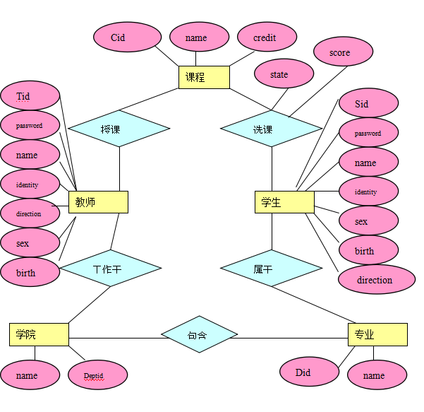

# 数据库课程设计

## 课题

 学生选课管理系统：定义相关类，实现学生选课信息的增删改查功能等；数据库可选Mysql和SqlServer。

### 1- 简单需求分析

1、系统可以准确地记录和查询学生信息，包括学生的姓名、专业、生日、性别以及身份证号码等，可以准确地记录学生的每一次奖惩情况。

2、系统可以对学校的院系情况进行管理，包括添加查询修改删除学院信息、添加查询修改删除某学院某专业信息等。

3、系统可以准确地记录和查询教师信息，包括教师的姓名、专业、生日、性别以及身份证号码等。

4、系统可以对开设的课程进行管理，包括课程信息的查询、添加、修改和删除，选课阶段、已开课、统计成绩、公布成绩三种状态。

5、系统可以对基础数据进行维护。

6、学生选课管理，学生只可以注销在选课阶段的课程，处于已开课、统计成绩、公布成绩的课程不可以注销。

7、系统可以提供强大数据统计、查询、报表生成以及打印等功能。

8、用户权限管理：本系统一共设置了三种用户身份，分别是管理员用户、教师用户和学生用户。

院系管理员可以管理增改删查所有学院情况、课程、老师、学生情况，修改密码

教师用户拥有修改、查看那自己所授课程和录入成绩的权限，修改密码

学生用户则拥有查询学籍信息、查询课程信息、选课、注销选课和查询成绩信息的权限。

9、异常处理。

#### 用户角度需求分析

此学生管理信息系统的主要功能如下图所示：

学生用户：修改个人信息、课程查询、选课、注销选课、成绩查询

教师用户：修改个人信息、修改所授课程信息、查看学生选课信息、成绩录入

管理员用户：学生管理、教师管理、课程管理、专业管理、学员管理、管理员操作

### 2-相关设计

#### 2.1 用户视图

##### 学生（Student）用户视图

（1） 修改个人信息。

（2） 按课程名、课程号、专业、学分等信息查询课程，选课和查询已选课程。

（3） 注销选课（只能注销选课阶段的课程，已公布成绩的课程不可注销）。

（4） 成绩查询（教师公布成绩后学生方可查看到自己的成绩）。

##### 3.2.2教师（Teacher）用户视图

（1） 修改个人信息。

（2） 修改所授课程的信息（一名教师可教授多门课程）。

（3） 录入、查看成绩（录入成绩的课程状态为“统计成绩” ，成绩录入的权限只有教师用户有）。

（4） 公布成绩（公布成绩后学生方可查看到自己的成绩）。

**（5）** ***\*备选功能：\****自动计算所授课程的选课人数、有成绩人数、平均成绩，且按成绩由高到低排序。查看所授课程选课情况。教师可以自主选课（教师所在学院方向的课程）。

##### 3.2.3学院管理员（Administrator）用户视图

（1） 学生管理：

查询、添加、修改、删除学生信息，添加学生奖惩信息

（2） 教师管理：

查询、添加、修改、删除教师信息。

（3） 课程管理：

查询、添加、修改、删除课程信息。

（4） 选课管理：

查询选课信息，添加选课信息（修改选课信息权限只有学生用户有），修改选课状态（选课阶段、已开课、统计成绩、公布成绩、结束）。

（5） 授课管理：

查询、添加、修改、删除授课信息。

（6） 专业管理：

查询、添加、修改、删除专业信息。

（7） 学院管理：

查询、添加、修改、删除学院信息。

（8） 管理员操作：

查询、添加、修改、删除学院管理员信息。

（9） 修改个人信息。

#### 2.2 用户数据需求

其中需求数据为：

1、 学生基本信息记录：

用户名、姓名、身份证号、方向、性别、生日、密码、奖惩信息

2、 教师基本信息记录：

用户名、姓名、身份证号、方向、性别、生日、密码

3、 管理员基本信息记录：

用户名、密码、姓名、权限等级

5、课程基本信息记录：

课程号、课程名、所属方向、学分

6、学院及专业基本信息记录：

学院：学院名称，学院号

方向：方向名称、所属学院

7、选课信息管理：

选课：学生用户选定课程的课程号、课程名、开课专业、学分、详细信息

注销选课：学生用户注销选课的课程号、课程名、任课教师、学分、课程状态（只能注销状态为选课阶段的课程）

8、授课信息管理：

课程号、课程名、教师号、教师姓名、选课人数

9、成绩信息管理：

学生查看：课程号、课程名、任课教师、学分、状态、成绩

教师录入：所授课程、学号、成绩

教师查看：名次、学号、姓名、学院、专业、班级、成绩

#### 2.3 测试数据需求

（1） 录入学生的基本信息：

学号、姓名、所属专业、性别、生日、身份证号

（2） 录入学生的选课信息

（3） 录入教师的基本信息：

学工号、姓名、院系、性别、生日、身份证号、研究方向

（4） 教师录入学生的成绩信息：

选择所授课程后，录入学号、成绩

（5） 录入课程的基本信息：

课程号、课程名、开课专业、学分

（6） 录入授课信息：

课程号、教师号

（7） 录入专业信息： 

专业名、所属学院

（8） 录入学院信息：

学院名、地址

（9） 录入学院管理员的基本信息：

管理员号、管理员姓名

（10） 录入超级管理员的基本信息

管理员号、管理员姓名

#### 2.4 数据查看需求

学生用户视图下：
（1） 列出学生基本信息
（2） 按照课程号列出课程的课程号、课程名、开课专业、学分
教师用户视图下：
（1） 列出教师基本信息
（2） 列出所授课程的基本信息
（3） 列出所授课程的学生选课信息：学号、姓名、所属专业、性别、生日、身份证号
管理员用户视图下：
（1） 按照学号列出学生的学号、姓名、所属专业、性别、生日、身份证号
（2） 按照学工号列出教师的学工号、姓名、院系、性别、生日、身份证号、研究方向
（3） 按照课程号列出课程的课程号、课程名、开课专业、学分
（4）按照课程号列出选课信息：课程号、课程名、学号、学生姓名、教师号、教师姓名、状态、成绩
（5）按照学生学号列出选课信息：课程号、课程名、学号、学生姓名、教师号、教师姓名、状态、成绩
（6）按照教师学工号列出选课信息：课程号、课程名、学号、学生姓名、教师号、教师姓名、状态、成绩
（7）按照课程号列出授课信息：课程号、课程名、教师号、教师姓名、选课人数
（8）按照课程名列出授课信息：课程号、课程名、教师号、教师姓名、选课人数
（9）按照教师学工号列出授课信息：课程号、课程名、教师号、教师姓名、选课人数
（10）按照学院管理员号列出学院管理员的管理员号、姓名
（11）按照超级管理员号列出超级管理员的管理员号、姓名

### 3- 逻辑设计

#### 3.1 E-R图

该ER图包括课程、教师、学生、学院、专业五个实体和授课、选课、工作于、属于、包含五个联系。

#### 3.2 数据表

| 实体           | 属性     | 描述         | 数据类型和长度 | 主键     | 是否允许空值 |
| -------------- | -------- | ------------ | -------------- | -------- | ------------ |
| 学院管理员     | Admin_id | 管理员用户名 | Varchar32      | Admin_id | 否           |
| Password       | 密码     | Varchar32    | 否             |          |              |
| Name           | 姓名     | Varchar32    | 否             |          |              |
| Dept           | 所属学院 | Varchar32    | 否             |          |              |
| Regist_date    | 注册日期 | Varchar32    | 是             |          |              |

| 学生           | Sid      | 学生用户名   | Varchar32      | Sid      | 否           |
| -------------- | -------- | ------------ | -------------- | -------- | ------------ |
| Password       | 密码     | Varchar32    | 否             |          |              |
| Name           | 姓名     | Varchar32    | 否             |          |              |
| Dept           | 学院     | Varchar32    | 否             |          |              |
| Major          | 专业     | Varchar32    | 否             |          |              |
| Sex            | 性别     | Varchar32    | 否             |          |              |
| Birth          | 生日     | Varchar32    | 否             |          |              |
| Identity       | 身份证号 | Varchar32    | 否             |          |              |

| 教师           | Tid      | 教师用户名   | Varchar32      | Tid      | 否           |
| -------------- | -------- | ------------ | -------------- | -------- | ------------ |
| Password       | 密码     | Varchar32    | 否             |          |              |
| Name           | 姓名     | Varchar32    | 否             |          |              |
| Dept           | 学院     | Varchar32    | 否             |          |              |
| Direction      | 研究方向 | Varchar32    | 是             |          |              |
| Sex            | 性别     | Varchar32    | 否             |          |              |
| Birth          | 生日     | Varchar32    | 否             |          |              |
| Identitiy      | 身份证号 | Varchar32    | 否             |          |              |

| 课程           | Cid      | 课程号       | Varchar32      | Cid      | 否           |
| -------------- | -------- | ------------ | -------------- | -------- | ------------ |
| Name           | 课程名   | Varchar32    | 否             |          |              |
| Parent_major   | 所属专业 | Varchar32    | 否             |          |              |
| Credit         | 学分     | Float8       | 否             |          |              |

| 学院           | Name     | 学院名称     | Varchar32      | Deptid   | 否           |
| -------------- | -------- | ------------ | -------------- | -------- | ------------ |
| Deptid         | 学院号   | Varchar32    | 是             |          |              |
| 课程状态       | ID       | 状态号       | Varchar32      | ID       | 否           |
| State          | 状态     | Varchar32    | 否             |          |              |
|                |          |              |                |          |              |

| 专业           | Name     | 专业名称     | Varchar32      | Did      | 否           |
| -------------- | -------- | ------------ | -------------- | -------- | ------------ |
| Did            | 专业号   | Varchar32    | 否             |          |              |
| Parent_college | 所属学院 | Varchar32    | 否             |          |              |

